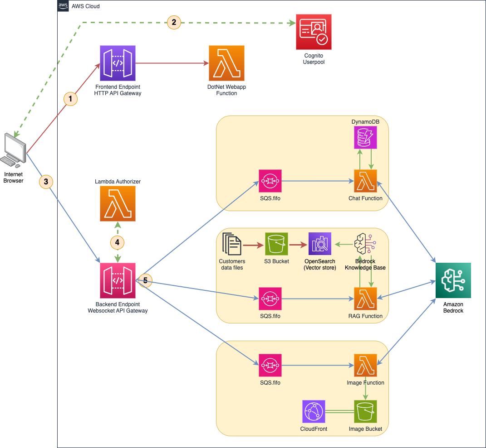

# Serverless DotNet application for Amazon Bedrock

## Overview

This DotNet application is designed to provide a serverless, efficient, and automated solution to interact with Amazon Bedrock. This application supports following features:

- **Have general conversations**
  - Ask questions on any topics
  - Information from web searches
  - Translate text to different languages
  - You can chat with following Foundational Models:
    - Amazon Titan Text Express v1
    - Anthropic Claude v2.1
    - AI21 Labs Jurassic-2 v1
    - Meta Llama 2 v1
- **Q&A using Retrieval-Augmented Generation**
  - This application stores Amazon annual report and letter to shareholders from 2019-2023 in its data bucket
  - Ask any question and it will try to find answer from those data
  - For example: `Summarize Amazon revenue from 2019, 2020, 2021 and 2022`
- **Text to image generation**
  - Generate images from given text using following Foundational Models
    - Amazon Titan Image Generator G1
    - Stability.ai Diffusion 1.0

## Solution Architecture



## Deployment Instructions

### Prerequisites
Enable following Foundational Models using [Amazon Bedrock Model Access console](https://docs.aws.amazon.com/bedrock/latest/userguide/model-access.html)
- Amazon Titan Text Express v1
- Anthropic Claude v2.1
- AI21 Labs Jurassic-2 v1
- Meta Llama 2 v1
- Amazon Titan Image Generator G1
- Stability.ai Diffusion 1.0

### Using CDK

#### CDK Prerequisites
- [AWS CDK 2.140+](https://github.com/aws/aws-cdk)
- [Docker](https://www.docker.com/)
- [DotNet CLI](https://learn.microsoft.com/en-us/dotnet/core/tools/)


_[optional] CDK uses your default AWS region. To deploy into a different region, you can set it using environment variable `export AWS_DEFAULT_REGION=<PREFERRED-AWS-REGION>` before running the `cdk` commands._


Run following command to deploy:
```
cdk deploy
```

Optionally, you can define following parameters with your deployment command:

```
cdk deploy --parameters LogRetentionDays=<NUMBER> --parameters CognitoDomainPrefix=<STRING>
```

If those parameters are not mentioned, CDK will use default values as below:

<ins>LogRetentionDays</ins><br>
Default value: 1<br>
Allowed values: [1, 3, 5, 7, 14, 30, 60, 90, 120, 150, 180, 365, 400, 545, 731, 1096, 1827, 2192, 2557, 2922, 3288, and 3653](https://docs.aws.amazon.com/AmazonCloudWatchLogs/latest/APIReference/API_PutRetentionPolicy.html)

<ins>CognitoDomainPrefix</ins><br>
Default value: bedrock-\<RANDOM-NUMBER\><br>
Allowed pattern: Alphanumeric. No whitespaces. Minimum length of 1. Maximum length of 63.

**Post deployment configuration**<br>
CDK will create a test Amazon Cognito User `user1` without a password. You need to set a password before you could use it.<br>
Once the CDK deployment is complete, it will provide you `CognitoUserPoolId` in its output. Use that when running following command:
```
aws cognito-idp admin-set-user-password --user-pool-id <COGNITO_USER_POOL> --username user1 --password <PASSWORD> --permanent
```

### Using CloudFormation
You can use native CloudFormation to deploy the solution if you do not prefer to use CDK. However, DotNet solution must be built and packaged for Lambda functions before you could deploy the template. Use `cfn_deploy.sh` script file which take care of everything, including password set for the test user at the end.

Run following command:
```
sh cfn_deploy.sh
```

## Usage
Use the link in `WebURL` from CDK or CFN output to access the application. By default, it creates a test user `user1` with the password that you defined. Use these credential to log in and use any of the available feature.

## License
This solution is licensed under the MIT-0 License. See the LICENSE file.